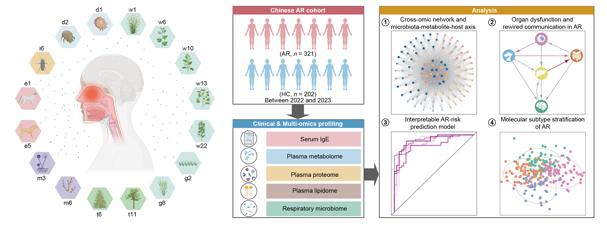

# Multi-omics analysis in Allergic Rhinitis

  

Overview of the allergic rhinitis study.

## Overview

This repository contains analysis scripts and representative outputs for the multi-omics analysis of allergic rhinitis(AR), including:

- Plasma proteome
- Metabolome
- Lipidome
- Respiratory microbiome
- Multi-omics integration
- Organ analysis
- AR risk prediction and stratification

## Key analyses
### 1. Proteome

- Differential protein analysis
- Functional enrichment analysis
- Protein-protein interaction analysis

### 2. Metabolome and lipidome

- Differential metabolite/lipid analysis
- Functional enrichment analysis

### 3. Respiratory microbiome

- Taxonomic profiling
- Differential microbial species
- Function profiling

### 4. Multi-omics integration

- DIABLO-based integration
- mmVec modeling
- Multi-omics network modules
- Microorganism-metabolite/lipid-host signaling path
- Mediation analysis

### 5. Organ analysis

- Organ risk index construction
- Organ interaction network analysis
- Differential organ correlation analysis
- Systemic organ dysfunction profiling

### 6. AR risk prediction and patient stratification

- Random forest classification
- SHAP analysis
- Feature selection
- Molecular subtype discovery

## Contact
Email: xjy005351@siat.ac.cn. For questions, collaborations, or bug reports, please open an issue or contact via email.

## License
This project is released under the MIT License.
